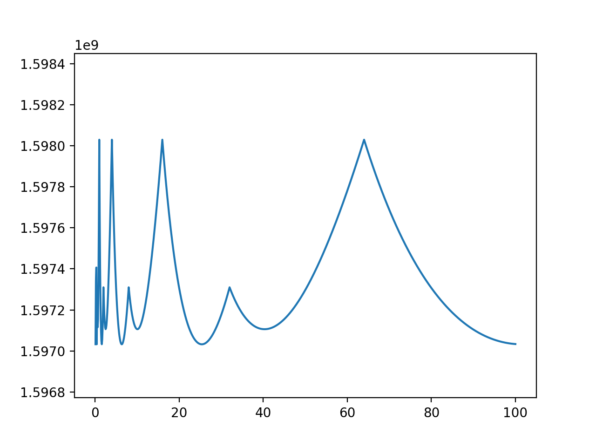
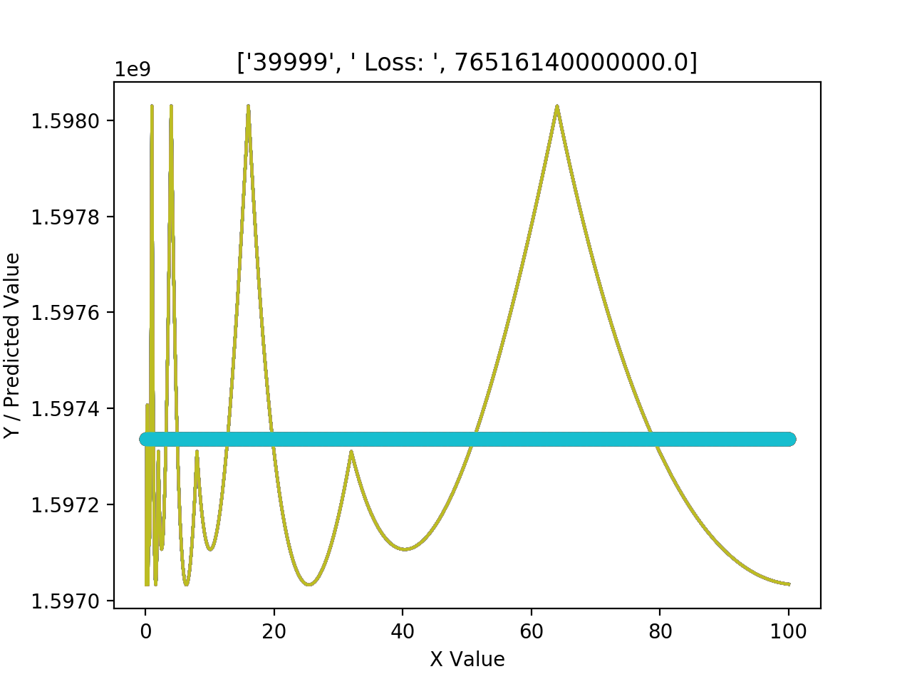

# Fast-Inverse-Square-Root-Magic-Number-Optimization
Testing out optimal magic numbers for the old fisqt function

## Searching for Optimal Magic Number
The fast inverse square root was a function designed to speed up the 1/x^2 operation, primarily for use in computer graphics. [Read more in the wikipedia article here.](https://en.wikipedia.org/wiki/Fast_inverse_square_root)

The function definition I used in Python is:
```
def struct_isqrt(number, magic=0x5f3759df):
    threehalfs = 1.5
    x2 = number * 0.5
    y = number

    packed_y = struct.pack('f', y)
    i = struct.unpack('i', packed_y)[0]  # treat float's bytes as int
    i = magic - (i >> 1)            # arithmetic with magic number
    packed_i = struct.pack('i', i)
    y = struct.unpack('f', packed_i)[0]  # treat int's bytes as float

    y = y * (threehalfs - (x2 * y * y))  # Newton's method
    return y
```

The file ```search_magic_num_fisqt.py``` contain the main algorithm.
It utlizies all available cores on the system for multiple processes to search as quick as possible. I implemented this to save a lot of time as 8 cores > 1 core searching.

## Initial Results



For different values for 1/x^2, the optimal magic number varies as seen in the graph. The optimal number used in the original algorithm is just about in the middle of the y values.

## Trying to train a neural net on this data

I couldn't think of an easy way to serialize this result, which is a continuous function, into a closed form equation. I tried some Tensorflow regression networks, as seen in ```nn_fisqty.py``` but the model just couldn't easily fit. I may come back to this later.

Terrible fit:



## Cool mathematical discussion

Got a lot of inspiration from this: [Some guy's thesis](https://cs.uwaterloo.ca/~m32rober/rsqrt.pdf)
